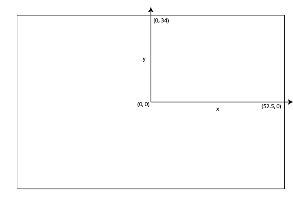

# SkillCorner Open Data

## About this repo

### Description

This repo contains data on 10 matches of broadcast tracking data collected by [SkillCorner](https://skillcorner.com), as well as the derived Dynamic Events for those 10 games. The matches included are a sample of 2024/2025 league matches in the Australian A-League

It also contains aggregated Physical data at the season level across all games ofseason

Broadcast tracking data is tracking data collected through computer vision and machine learning out of the broadcast video.

### Motivation

This data has been open sourced in a joint initiative between [SkillCorner](https://skillcorner.com) and [PySport](https://pysport.org/). The goals are multiple:
* Provide access to tracking data to researchers and the sports analytics community.
* Increase awareness on the existence of broadcast tracking data, and how it can be of benefit to clubs, media and the betting industry.
* Allow SkillCorner prospects to access data easily, parse our data format and get started building on top of it.

Thus, if you use the data, we kindly ask that you credit SkillCorner and hope you'll notify us on [Twitter](https://twitter.com/skillcorner) so we can follow the great work being done with this data.

## Documentation

### Data Structure

The `data` directory contains:

* `matches.json` file with basic information about the match. Using this file, pick the `id` of your match of interest.
* `matches` folder with one folder for each match (named with its `id`).
* `aggregates` folder with CSVs for season-level, aggregated data (Physical, Off-Ball Runs, and Passing) for the AUS 1 League in 2024/2025.

For each match, there are four files files:

* `{id}_match.json` contains lineup information, time played, referee, pitch size...
* `{id}_tracking_extrapolated.jsonl` contains the tracking data (the players and the ball).
* `{id}_dynamic_events.csv` contains our Game Intelligence's dynamic events file (See further for specs.)
* `{id}_phases_of_play.csv` contains our Game Intelligence's PHASES OF PLAY framework file. (See further for specs.)

### 📍 Tracking Data Description

The tracking data is a list. Each element of the list is the result of the tracking for a frame, it's a dictionary with keys:

* frame: the frame of the video the data comes from at 10 fps.
* timestamp: the timestamp in the match time with a precision of 1/10s.
* period: 1 or 2.
* ball_data: the tracking data for the ball at this frame. Dictionary
* possession: dict with keys player_id and group which indicates which player/team (home or away team) are in possession
* image_corners_projection: coordinates of polygon of the detected area. 
* player_data: list of information of the players at the given frame.  

Each element of the player_data list is a player found at this frame. It's a dictionary with keys:

* x: x coordinate of the object
* y: y coordinate of the object
* player_id: identifier of the player
* is_detected: flag that mentions if the player is detected on the screen or extrapolated

For the spatial coordinates, the unit of the field modelization is the meter, the center of the coordinates is at the center of the pitch.

The x axis is the long side and the y axis in the short side.

Here is an illustration for a field of size 105mx68m.

### 📊 Season Aggregates (Physical, OBR, Passing)

The aggregate data is provided at a player-season level and contains key metrics across three categories:
- **Physical**: Metrics such as PSV99, high-intensity counts, and distance covered.
- **Off-Ball Runs (OBR)**: Tactical metrics identifying types of runs and their outcomes.
- **Passing**: Aggregated passing volume and efficiency metrics.

The datasets are filtered for performances above 60 minutes only. For more details, refer to the [Physical Data Glossary](https://skillcorner.crunch.help/en/glossaries/physical-data-glossary).

### ⚡ Dynamic Event Data

The dynamic_events data is a CSV. Each row corresponds to a specific event_id belonging to 4 subcategories.
Note:
* an event_id is unique *to a game only*
* the x/y attributes of each event are not scaled to standard pitchsize and require adjustement

For a full documentation of dynamic_events, refer to this [documentation here](https://26560301.fs1.hubspotusercontent-eu1.net/hubfs/26560301/Guides/Dynamic%20Events/20250216%20-%20Dynamic%20Events%20CSV%20Specifications.pdf)

### 🔄 Phases of Play File

The phase of play data is CSV. Each row corresponds to the start and end frames of a given phase

* Phases of play capture which phase the attacking and defending team are in concurrently.
* Phases of play are only defined when the ball is in play. When the ball is out of play there is no phase of play
* Each in-possession phase directly corresponds to an out-of-possession phase.

For detailed information on phases of play, refer to this [documentation](https://26560301.fs1.hubspotusercontent-eu1.net/hubfs/26560301/Guides/Phases%20of%20Play/20250216%20-%20Phases%20of%20Play%20CSV%20Specifications.pdf)

## ⚠️ Limitations

TRACKING
* Some data points are erroneous. Around 97% of the player identity we provide are accurate.
* Some speed or acceleration smoothing and control should be applied to the raw data.

## Working with the data

We've organized our tutorials into logical learning paths to help you navigate the data. You can access all our [**Tutorial Notebooks in the `notebooks/tutorials` folder**](notebooks/tutorials/README.md):

* **Path 01: Getting Started with SkillCorner Data** - Focusing on foundational performance data and basic normalization workflows.
* **Path 02: Working with Game Intelligence & Dynamic Events** - Deep dives into contextual data layers (Dynamic Events, Phases of Play, Off-ball Runs, Animations, and Custom Metrics).
* **Path 03: Basics of Tracking** - Working directly with raw X/Y coordinates and spatial data formats.
* **Path 04: Visualization Bank** - Innovative fun visualizations

Additionally, reusable Python code for loading and modeling data has been organized into the [**`src/`**](src/README.md) directory. SkillCorner customers will also find commented code they can use to connect to their match_ids using their credentials.

Online versions are available as well for:
* TRACKING Notebook: [GoogleColab](https://colab.research.google.com/drive/16JTBpuoDFoZ-PRiztLX4CPZmCatKtem7).
* SKILLCORNER VIZ visualization Library: [GoogleColab](https://colab.research.google.com/drive/1-uD-kWH7ya-PyG585L2qymVcQrBTtjFo#scrollTo=z5B8GqPiCGan)

## 🏗️ Repository Structure & Contributing

To maintain clarity and structure, please follow this framework when adding new content:

* **`data/`**: Strictly for datasets (e.g. JSON, CSV). Use `data/matches/` for raw data and `data/aggregates/` for processed data.
* **`notebooks/`**: Strictly for Jupyter notebooks.
  * `notebooks/tutorials/`: Nested by path (e.g., `01_Getting_Started...`, `02_Working_with_Game_Intelligence...`, `03_Basics_of_Tracking...`).
  * `notebooks/exploratory/`: Private local folder for drafts (Git ignored).
* **`src/`**: Reusable Python source code. Place data loading scripts in `src/data/`, feature engineering in `src/features/`, and reporting visuals in `src/visualization/`.
* **`assets/`**: Static files like images for documentation.
* **`archive/`**: Unused, testing, or scratch files (ignored by Git).

## Future works

* We intend to open source more tooling to help people get started with our data.
* We are not an event data provider ourself, though we intend to provide some tools to synchronize tracking and event data, that you'll be able to use if you can access event data.

## PySport competition results

* [Hadi Sotudeh - Analytics Cup Research](https://github.com/hadisotudeh/analytics_cup_research)
* [Zachary Cochran - SkillCorner Analytics Cup Tracking Data Research](https://github.com/zcochran4275/skill_corner_analytics_cup_tracking_data_research)
* [Amar Shah - Analytics Cup Research](https://github.com/amarshah1999/analytics_cup_research)
* [Emaly Vatne - Analytics Cup Research VatneEmaly](https://github.com/emalyvatne/analytics_cup_research_VatneEmaly)
* [2nzi - SkillCorner Analytics](https://github.com/2nzi/skillcorner-analytics)
* [Data Kicks - Dynamic Skills Finder](https://github.com/Data-Kicks/Dynamic-Skills-Finder)

## Contact us

* If you have some feedback, some project research that you want to conduct with our data, reach us on [our website](https://skillcorner.com/#contact-section) or on [Twitter](https://twitter.com/skillcorner)
* If you're interested in our product and want more commercial information contact us on [our website](https://skillcorner.com/#contact-section)
